# Workshop UnrealEngine Part 3

## Introduction

Bienvenue dans ce workshop UnrealEngine.

Dans ce workshop, nous allons voir comment importer des modèles exterieurs et créer des particules.

Ce workshop est découpé en 4 parties :

- Partie 1 : [Création/Sculpture/Peinture du terrain](https://github.com/Kenan-Blasius/Workshop-UnrealEngine-Part-1)
- Partie 2 : [Création de décors](https://github.com/Kenan-Blasius/Workshop-UnrealEngine-Part-2)
- Partie 3 (ce workshop) : [Importation de model exterieur/Création de particule](https://github.com/Kenan-Blasius/Workshop-UnrealEngine-Part-3)
- Partie 4 : [Apprentissage du Blueprint](https://github.com/Kenan-Blasius/Workshop-UnrealEngine-Part-4)

## Importation de model exterieur

Afin d'importer un model exterieur, il faut tout d'abord le télécharger. Pour cela, clonez le repository.

Une fois le repository cloné, dans le dossier `Workshop-UnrealEngine-Part-3/ressources/Mesh`, vous trouverez un fichier `SM_Teapot.fbx`.

Ce fichier est un model 3D de théière. Nous allons l'importer dans UnrealEngine.

Pour cela il vous suffit de faire un glisser-déposer du fichier `SM_Teapot.fbx` dans le dossier `Content` de votre projet UnrealEngine.

Une fenêtre comme celle-ci devrait s'ouvrir :

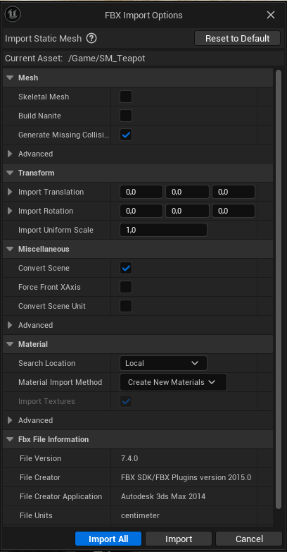

Dans cette fenêtre, vous pouvez choisir les paramètres d'importation de votre model.

Décochez la case `Generate Missing Collision` et cliquez sur `Import`.

Vous devriez maintenant voir votre model dans le dossier `Content` de votre projet UnrealEngine.

Maintenant que le model est importé, nous allons le placer dans notre scène.

Posez votre théière sur la table.

Mais vous devriez voir que la théière est beaucoup trop grosse par rapport à la table.

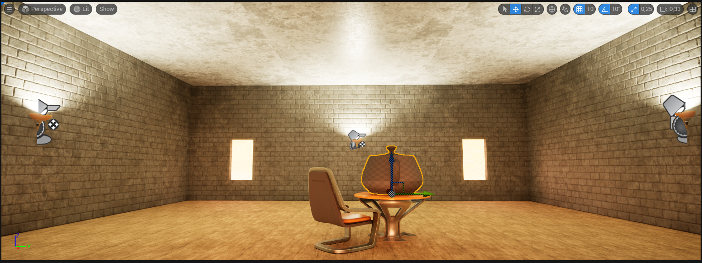

Pour régler ce problème, il faut modifier la taille de la théière.

Pour cela, il y a plusieurs solutions :

- Sélectionnez la théière dans la scène, puis dans la fenêtre `Details` à droite, modifiez la valeur de `Scale` en `0.3` sur chaque axe.
- Sélectionnez la théière dans la scène, puis dans la fenêtre `Details` à droite, cliquez sur le cadenas à coté de `Scale` pour modifier la valeur de `Scale` sur tous les axe en même temps.
- Comme pour appliquer une rotation au mur, passez en mode `Scale` en cliquant sur l'icone `Scale` en haut à droite de la fenêtre, puis cliquez sur la théière dans la scène et modifiez la taille de la théière en cliquant sur les cubes rouges, verts et bleues.

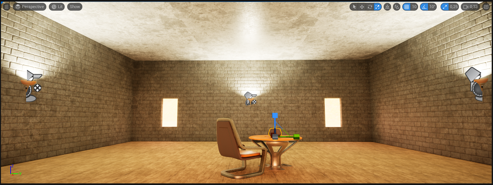

Maintenant que la théière est à la bonne taille, nous allons lui appliquer un matériau.

Pour cela, il faut tout d'abord créer un matériau.

Pour créer un matériau, cliquez-droit dans le dossier `Content` de votre projet UnrealEngine, puis cliquez sur `Material`.

Nommez le comme vous voulez, puis double-cliquez dessus pour l'ouvrir.

Cliquez sur `Base Color` et déposez à coté pour créer un `Constant3Vector`.

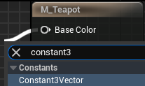

Changez la couleur du `Constant3Vector` en cliquant dessus et choisissez la couleur de votre choix.

Vous devriez avoir quelque chose comme ça :

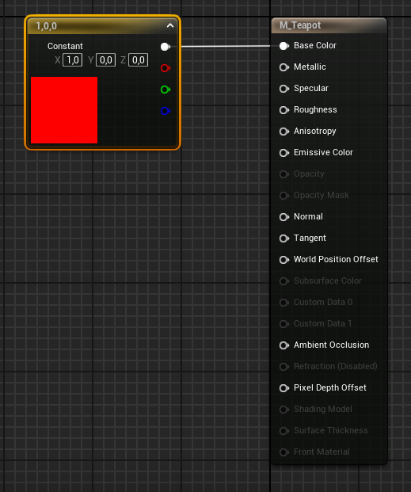

Cliquez sur `Apply` en haut à droite pour appliquer les changements au matérial et fermez la fenêtre.

Maintenant que le matérial est créé, nous allons l'appliquer à la théière.

Pour cela vous pouvez faire un glisser-déposer du matérial sur la théière dans la scène afin de l'appliquer à l'instance de la théière dans la scène.

Ou bien vous pouvez modifier le matérial de la static mesh de la théière afin que toutes les instances de la théière aient ce matérial.

Pour cela, double-cliquez sur la théière dans le dossier `Content` de votre projet UnrealEngine.

Dans la fenêtre `Details` à droite, dans `Material Slots`, modifier le matérial de `Element 0` en cliquant sur la flèche à coté de `WorldGridMaterial` et en sélectionnant le matérial que vous venez de créer.

Vous pouvez maintenant voir que la théière a changé de couleur.

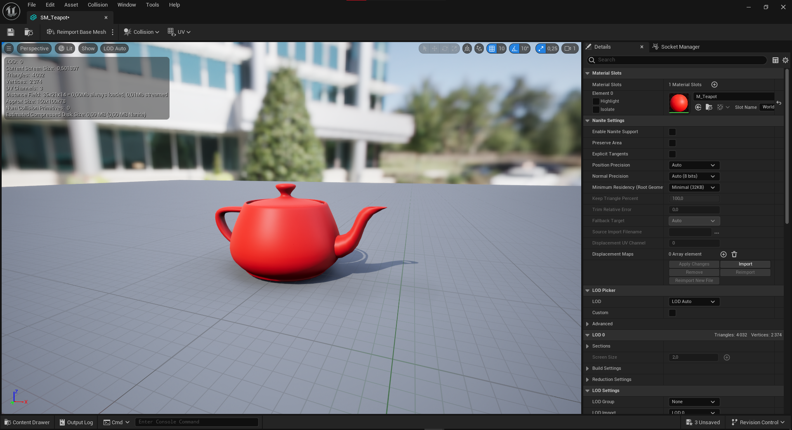

Vous pouvez maintenant fermer cette fenêtre.

Nous allons maintenant un mouvement de rotation à la théière.

Pour cela, nous allons ajouter un `Rotating Movement` à la théière.

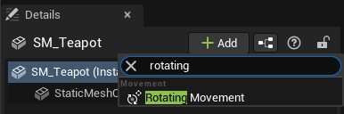

Vous pouvez cliquez sur `Play` en haut à gauche pour voir le résultat.

Vous devriez voir que la théière ne tourne pas.

C'est parce que notre théière est en mode `Static`, il faut donc la passer en mode `Movable`.

Pour cela cliquez sur la théière dans la scène, puis dans la fenêtre `Details` à droite, dans `Transform`, cliquez sur `Movable`.

> [!tip]
> Il y a 3 modes pour les objets :
>
> - Static: L'objet ne bouge pas et ne peut pas être changer pendant le jeu.
> - Stationary: L'objet ne bouge pas mais peut être changer pendant le jeu.
> - Movable: L'objet peut bouger et peut être changer pendant le jeu.

Vous pouvez maintenant cliquer sur `Play` en haut à gauche pour voir le résultat.

Vous devriez voir que la théière tourne.

## Création de particule

Nous allons maintenant créer une particule.

Dans un premier temps, nous allons créer un matérial pour notre particule.

Importez donc le ficher `T_Star_01.bmp` présent dans le dossier `Workshop-UnrealEngine-Part-3/ressources/Texture` dans le dossier `Content` de votre projet UnrealEngine.

Puis créez un nouveau matérial comme vous l'avez fait pour la théière.

Ouvrez votre matérial et dans les `Details` à gauche, changez le `Blend Mode` en `Translucent` et le `Shading Model` en `Unlit`.

Ajoutez maintenant la texture `T_Star_01` à votre matérial comme vous l'avez fait pour votre LandScape.

Ajoutez également deux node `Multiply` et un node `Particle Color` à votre matérial.

Reliez vos nodes comme sur l'image ci-dessous :

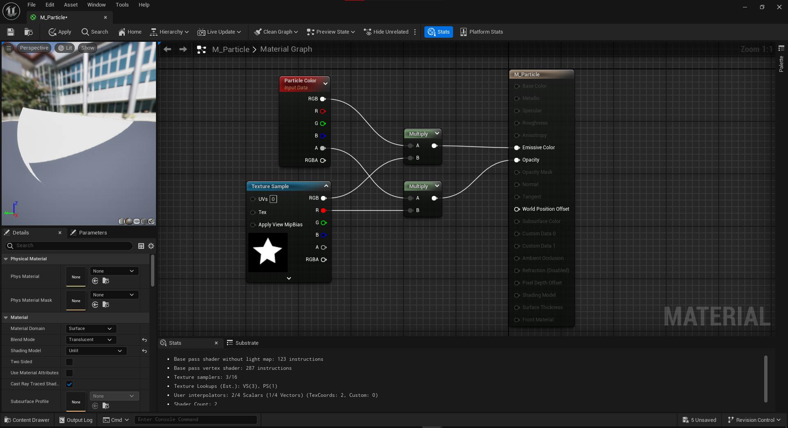

Pensez à cliquer sur `Apply` en haut à gauche pour appliquer les changements à votre matérial.

Vous pouvez maintenant fermer la fenêtre.

Nous allons maintenant créer notre particule.

Pour cela, cliquez-droit dans le dossier `Content` de votre projet UnrealEngine, puis cliquez sur `Niagara System`.

Puis séléctionnez `New system from selected emitter(s)` > `Next` > `Fountain` > `+` > `Finish`.

Nommez votre particule comme vous le souhaitez.

Vous pouvez maintenant double-cliquez sur votre particule pour l'ouvrir.

Vous devriez voir quelque chose comme ça :

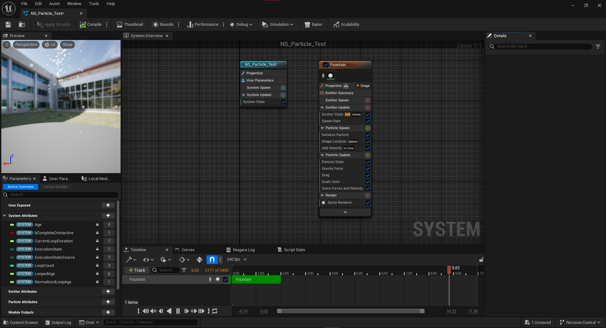

Nous allons maintenant modifier notre particule pour y appliquer notre matérial.

Pour cela, cliquez sur `SpriteRenderer` puis dans la fenêtre `Details` à droite changez le `Material` en cliquant sur la flèche à coté de `DefaultSpriteMaterial` et en sélectionnant votre matérial.

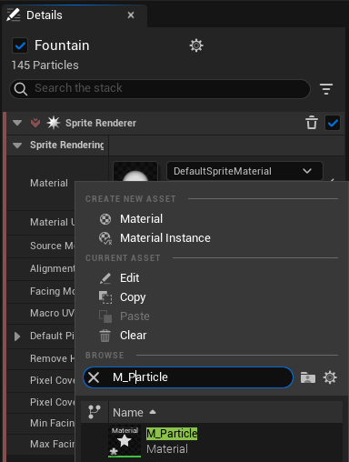

Dans `Fountain` (où se trouve `SpriteRenderer`), supprimez `Shape Location`.

Cliquez sur `Spawn Rate` et changez la valeur de `Spawn Rate` à `20`.

Cliquez sur `Initialize Particle` puis :

- Changez la valeur de `Lifetime Min` à `0.5`
- Changez la valeur de `Lifetime Max` à `1.5`.
- Changez `Color Mode` en `Random Range`.
- Changez `Color Minimum` par la couleur de votre choix.
- Changez `Color Maximum` par la couleur de votre choix.
- Changez `Uniform Sprite Size Min` à `25`.
- Changez `Uniform Sprite Size Max` à `50`.

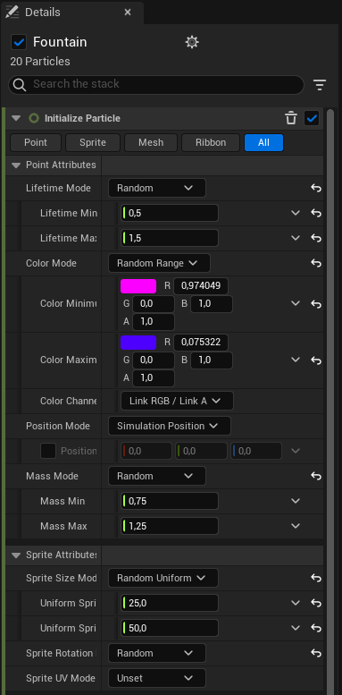

Vous pouvez ajouté votre `Niagara System` à votre scène en faisant un glisser-déposer de votre `Niagara System` dans la scène.

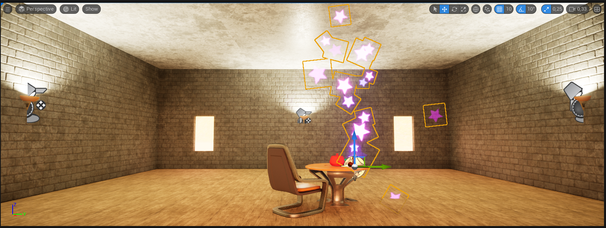

Maintenant glissez votre `Niagara System` sur votre théière dans la scène pour l'attacher à la théière (dans l'`Outliner`).

Déplacez votre `Niagara System` pour que les particules sortent de la théière.

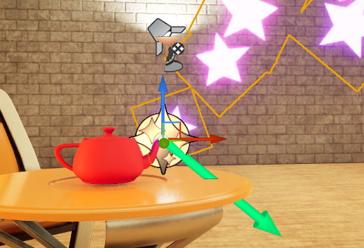

Maintenant si vouss faites `Play`, vous devriez voir les particules sortir de la théière et tourner avec la théière.

Retournons maintenant dans notre `Niagara System` pour améliorer notre particule.

Ajouter un `Emitter` (clique-droit sur `Niagara System` > `Add Emitter...`), selectionnez `Empty` et nommez-le `Ribbon`.

Sur votre `Ribbon`, supprimez `Sprite Renderer` et créez un `Ribbon Renderer` (`+` à coté de `Render`).

Ajoutez un `Spawn Rate` (`+` à coté de `Emitter Update`) et changez la valeur de `Spawn Rate` à `10`.

Ajouter un `Add Velocity` (`+` à coté de `Particle Spawn`).

Quand vous ajoutez le `Add Velocity`, vous devriez voir une erreur comme celle-ci :

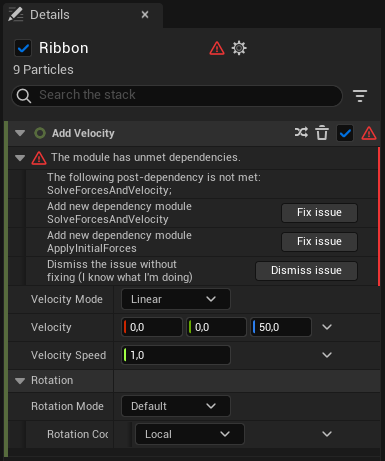

Cliquez sur `Fix issue` pour corriger l'erreur.

Un long trait devrait apparaitre dans votre `Niagara System`.

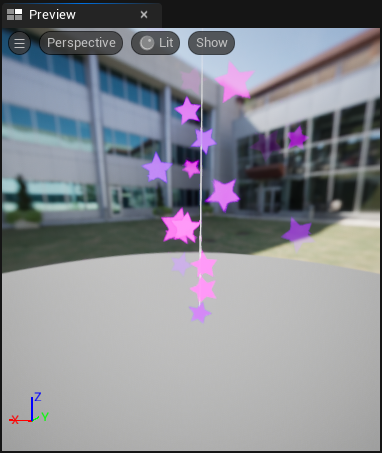

Si cela est le cas, vous pouvez supprimer le `Add Velocity` et le `Spawn Rate` que vous venez d'ajouter.

Maintenant, dans le `Fountain` Emitter, ajoutez un `Generate Location Event` et un `Generate Death Event` (`+` à coté de `Particle Update`).

Toujours dans le `Fountain` Emitter, cliquez sur `Properties` et cochez `Requires Persistent IDs`.

Maintenant, dans le `Ribbon` Emitter, ajoutez un `Event Handler` (`+ Stage` à coté de `Properties`).

Dans `Event Handler`, changez `Source` en `LocationEvent`, changez `Execution Mode` en `Spawned Particles` et changez le `Spawn Number` en `1`.

Ajoutez un `Receive Location Event` (`+` à coté de `Event Handler`).

Dans `Receive Location Event`, changez `Normalized Age` en `Apply` et `Color` en `Apply`.

Dans le `Fountain` Emitter, ajoutez une `Collision` (`+` à coté de `Particle Update`).

Vous devriez avoir quelque chose comme ça :

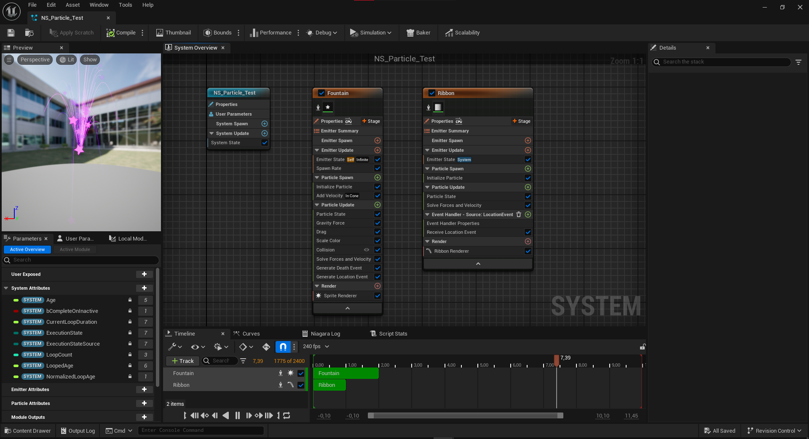

Vous pouvez maintenant fermer la fenêtre.

Et vous devriez avoir un rendu similaire à celui-ci :

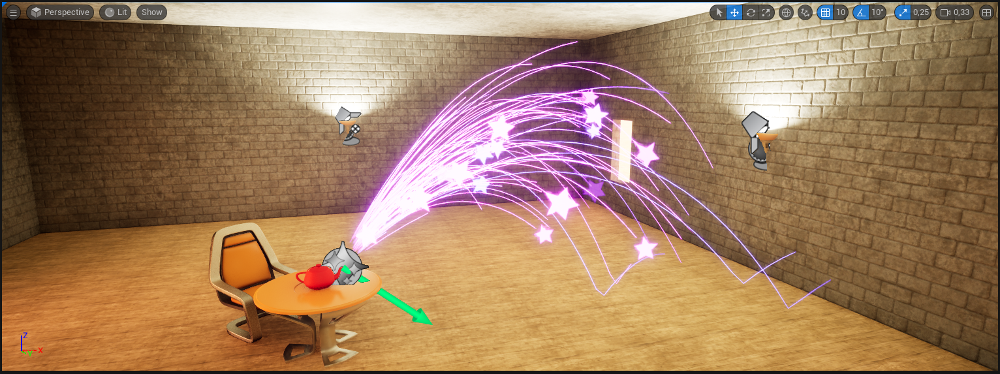

## Ajout de son

Nous allons maintenant ajouter un son à notre particule.

Pour cela, importez le fichier `SW_sparkshot01.ogg` présent dans le dossier `Workshop-UnrealEngine-Part-3/ressources/Sound` dans le dossier `Content` de votre projet UnrealEngine.

Une fois le fichier importé, créez un nouveau `Sound Cue` en cliquant-droit sur le son que vous venez d'importer puis en cliquant sur `Create Cue`.

Nommez votre `Sound Cue` comme vous le souhaitez.

Double-cliquez sur votre `Sound Cue` pour l'ouvrir.

Vous devriez voir quelque chose comme ça :

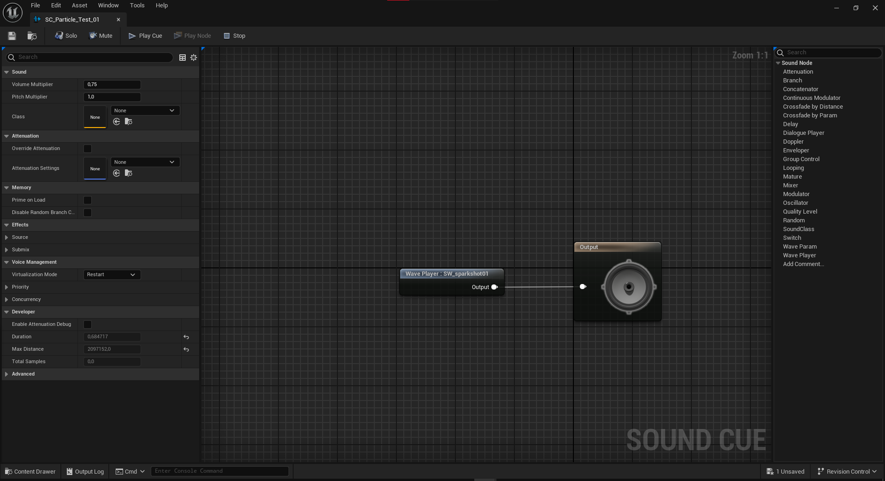

Maintenant, dans `Sound Cue`, ajoutez un `Modulator` entre le `WavePlayer` et le `Output`.

Ajustez le `Volume` et le `Pitch` du `Modulator` comme vous le souhaitez.

Puis cliquez sur `Output` et cochez `Override Attenuation`.

Maintenant, dans `Output`, cliquez sur `Attenuation` et changez la valeur de `Inner Radius` à `100` et la valeur de `Falloff Distance` à `800`.

Vous pouvez maintenant fermer la fenêtre.

Nous allons maintenant ajouter le son à notre particule.

Pour cela, ouvrez votre `Niagara System` et dans le `Fountain` Emitter, ajoutez un `Play Audio` (`+` à coté de `Particle Spawn`).

Dans `Play Audio`, changez `Sound to play` en cliquant sur la flèche à coté de `None` et en sélectionnant votre `Sound Cue`.

Ajustez le `Volume` et le `Pitch` comme vous le souhaitez.

Cependant, vous remarquerez que le son se joue à chaque particule.

Pour régler ce problème, nous allons changer le `Play Audio Mode` en `Random` au lieu de `Direct Set`, vous pourrez ainsi ajuster le `Probability` pour régler la probabilité que le son se joue.

Définissez le `Probability` à `0.1`.

Vous pouvez maintenant fermer la fenêtre.

Vous pouvez maintenant `Play` votre scène et vous devriez entendre le son se jouer de temps en temps et être emis par les particules.

## Conclusion

Vous avez maintenant les bases pour importer des modèles exterieurs et créer des particules.

Vous pouvez maintenant créer votre propre scène et y ajouter des modèles exterieurs et des particules.
